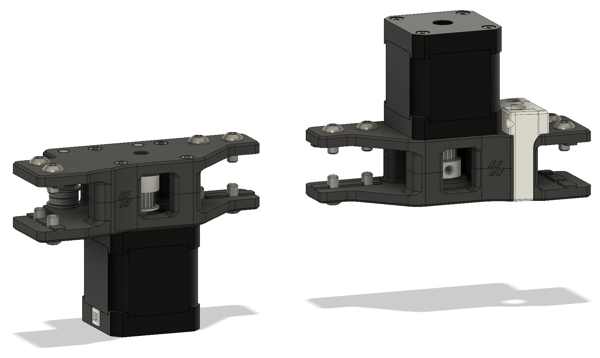
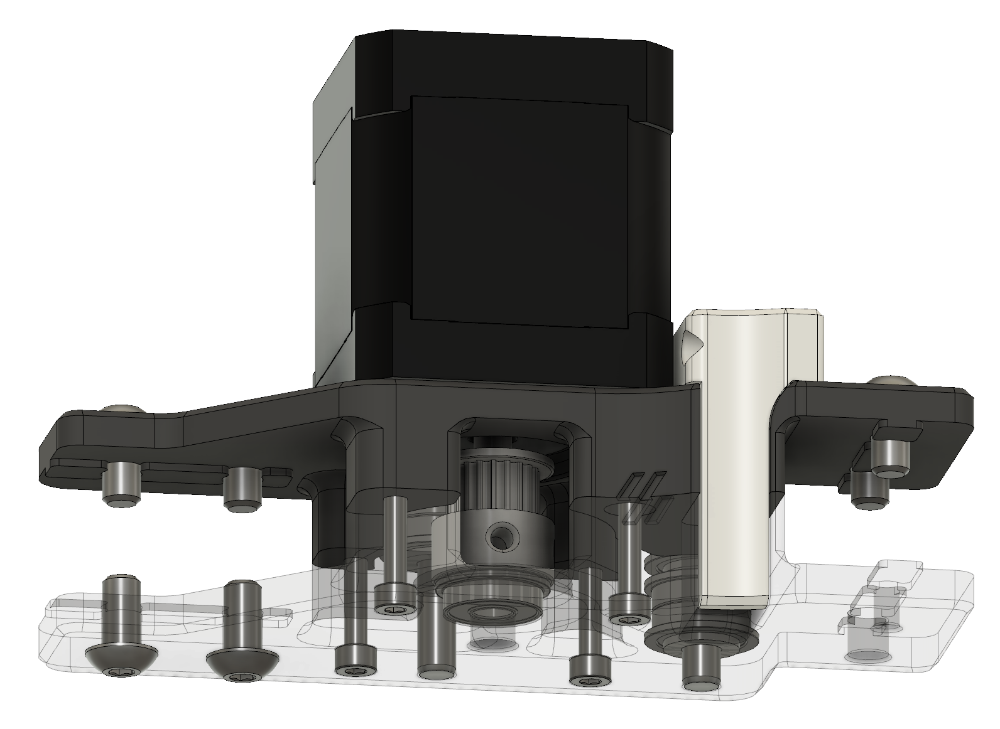

# AB Stepper Mounts Pin Bearing

**Trident AB Stepper Mounts using pins and bearing**

Trident AB stepper mounts using 30 mm pins for the idler assemblies and F695 bearings to support the stepper shafts.

Disclaimer: Only tested this on my printer, use at your own risk.

Credits for the original stepper mount design go to the Voron team 
https://vorondesign.com/
