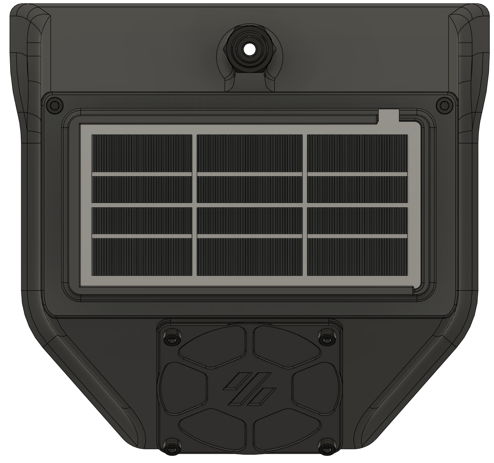
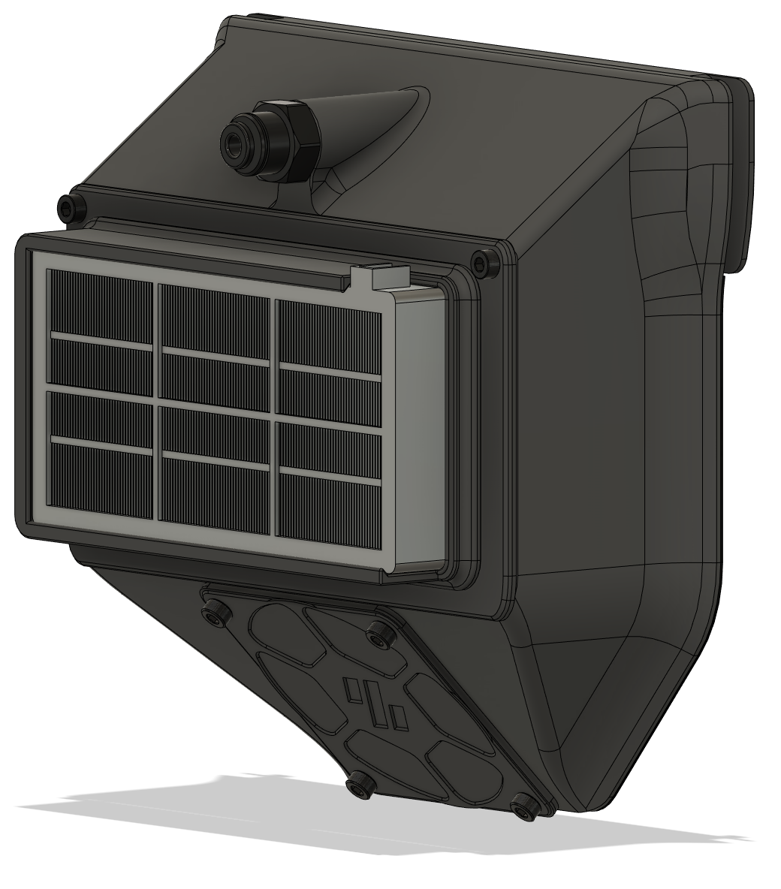
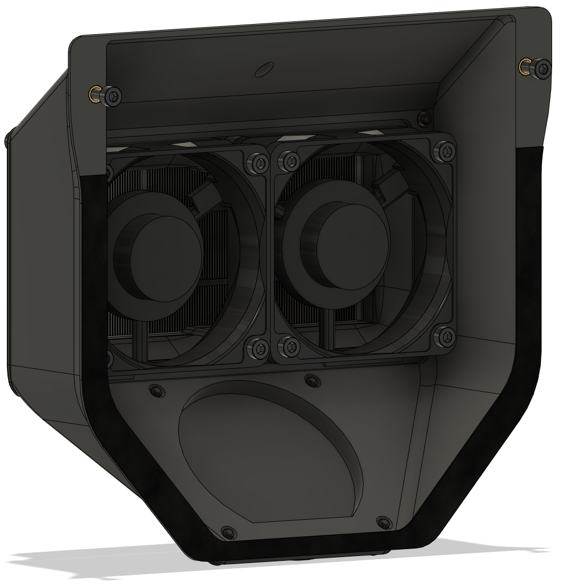

# Exhaust HEPA Filter

**Voron Trident exhaust using a Roomba 800/900 series HEPA filter**

With the Nevermore installed to address the VOC the next step was an easy to replace HEPA filter to collect the UFP when venting the chamber after a print completes. Had some Roomba HEPA filters laying around so made a fan/filter mount to fit the original exhaust. The filter can be slid in and out for easy maintenance.

An additional advantage to having the fans on the inside is the wiring for the fans can be easily internally routed through the exhaust grill:   
No wires on the outside of your printer!

BOM:
- 1x Roomba 800/900 series HEPA filter
- 2x 6020 fan
- 8x M3 heat inserts
- 8x M3 x 30 bolts

Credits for the original exhaust go to the Voron team: https://vorondesign.com/  
  
Credits for the original design of the 'Fan_Hole_Cover_v2' go to LoganFraser: https://github.com/LoganFraser/VoronMods/tree/main/TridentInvertedElectronics
