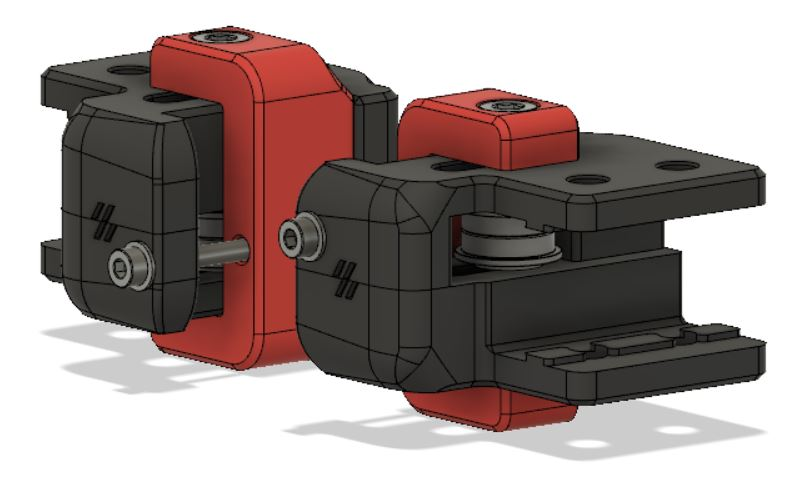

# Idlers Tensioners Aligned

**Trident front idlers with tensioners aligned to bearings**

Modified front idlers as I was experiencing some tilting of the front idlers/bolts. In my head aligning the center point of tilt and tension makes sense, they run true now. 
This modification also prevents splitting of the two printed parts.

Disclaimer: Only tested this on my printer, use at your own risk.

All credits to the Voron team 
https://vorondesign.com/
