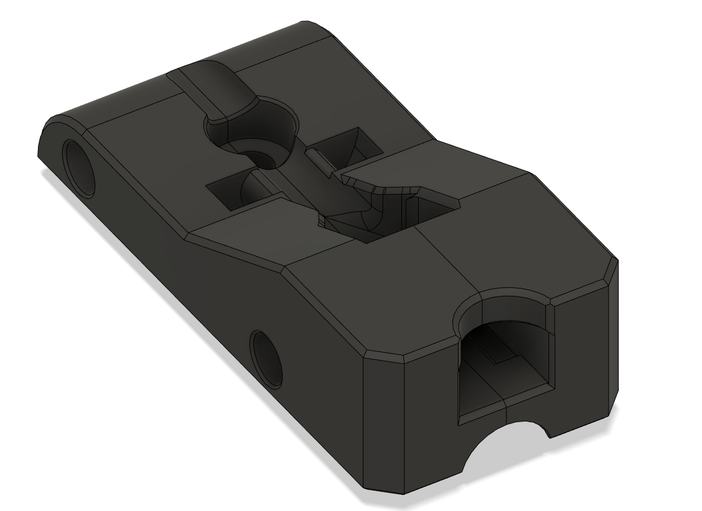

# Microfit 2020 Mount 1x2

A mount for attaching a 1x2 Microfit plug to a 2020 extrusion.

**BOM**
- 2x M2x10 self-tapping screw
- 1x M3x6 or M3x8 button head screw (BHCS) for mounting to the extrusion  

Credits for the original design go to samwiseg0  
https://github.com/samwiseg0/VoronUsers/tree/samwiseg0_mods/printer_mods/samwiseg0/ab_plug_microfit_1x4  

Which is derived from Ramalama2's AB Motor Plug  
https://github.com/Ramalama2/Voron-2-Mods/tree/main/AB_Plug_Microfit
