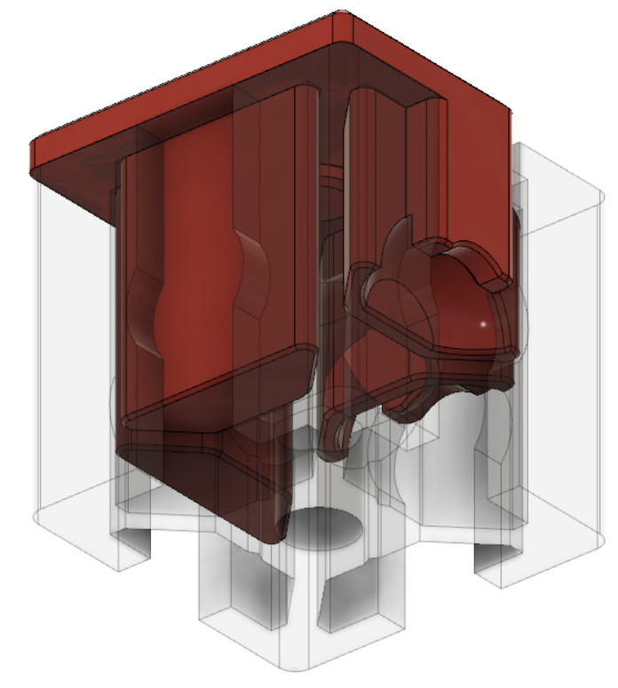
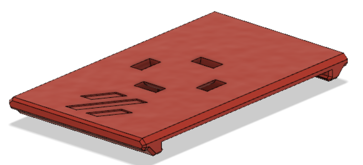

# Trident Mods

Some modifications and add-ons for the Voron Trident.

**Blind Joint Corner Plug**
This plug covers the blind joint holes in the top corners of the 2020 extrusions to better seal the chamber.

**DIN Rail ZIP Mount**
Clip-on DIN rail mount for zip ties/tie wraps.

