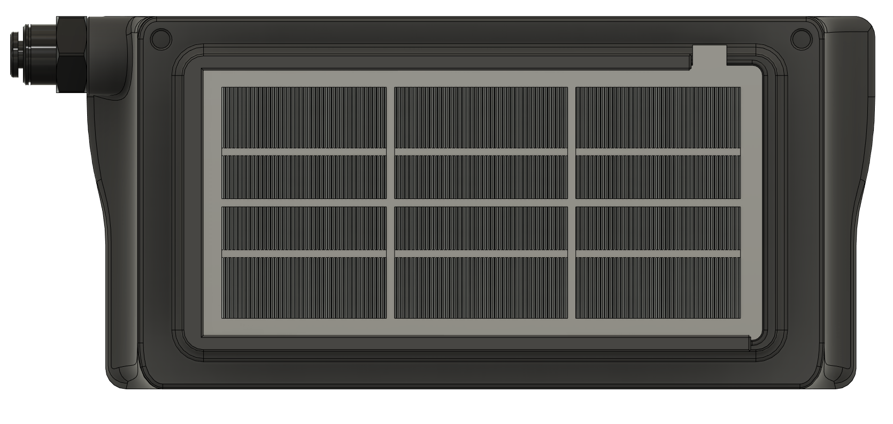
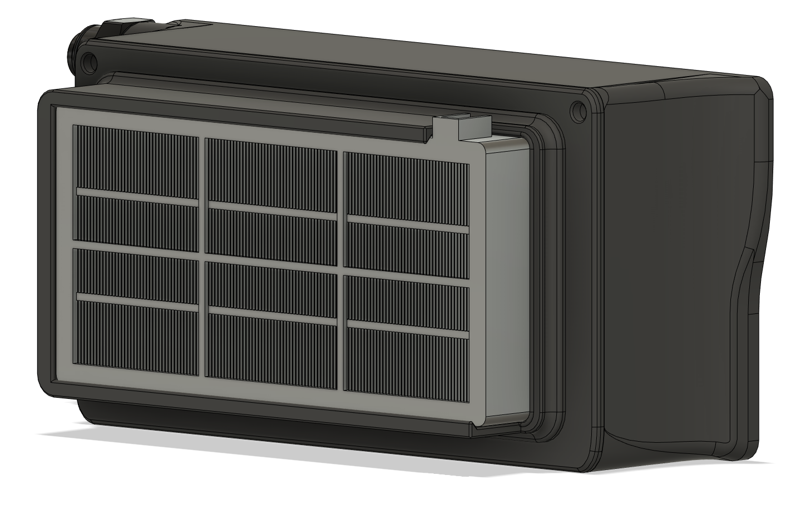

# Small Exhaust HEPA Filter

**Small Voron Trident exhaust using a Roomba 800/900 series HEPA filter**  
With the Nevermore installed to address the VOC inside of the chamber, the next step was an easy to replace HEPA filter to collect the UFP when venting the chamber after a print completes. Had some Roomba HEPA filters laying around so made a fan/filter mount to fit the original exhaust. Two 6020 fans push the chamber air out through the filter.
This is a minimalistic redesign of the original exhaust to just fit the 6020 fans and filter mount.

**Easy maintenance**  
The filter can be slid in and out from the outside of the exhaust, no screws. The foam edge on these filters makes a good seal and a tight fit.

**Additional advantages to having the fans on the inside of the exhaust**  
The wiring for the fans can be internally routed through the exhaust grill, so no wires on the outside of your printer.  
No fingers can be harmed by spinning fan blades.

**BOM**
- 1x Roomba 800/900 series HEPA filter
- 2x 6020 fan
- 7x M3 heat inserts
- 7x M3 x 30 bolts

**STLs to print**
- Exhaust_Housing_Small.stl
- Fan_Mount.stl
- Filter_Holder.stl

**Note**  
For a HEPA filter mod to mount to the original exhaust look here: https://github.com/pila81/Trident_Mods/tree/main/Exhaust_HEPA_Filter

Credits for the original exhaust go to the Voron team: https://vorondesign.com/  
