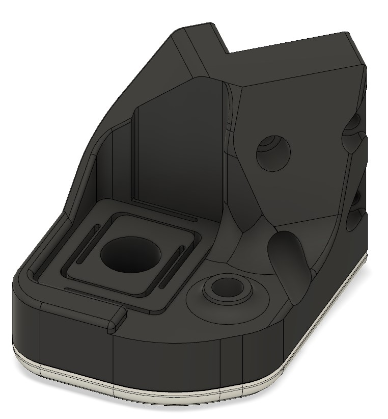
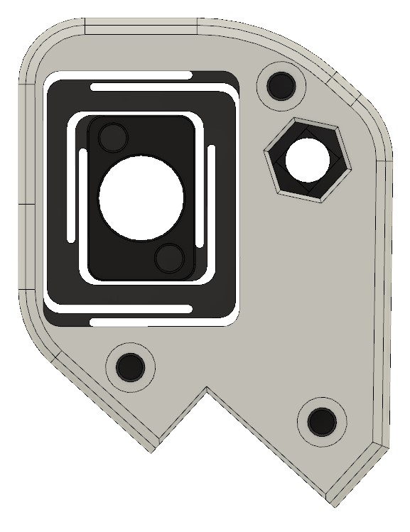
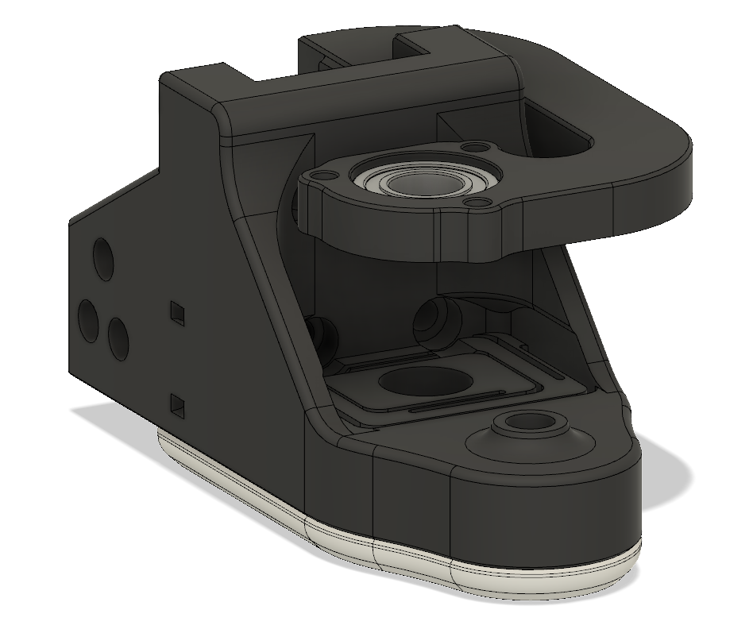
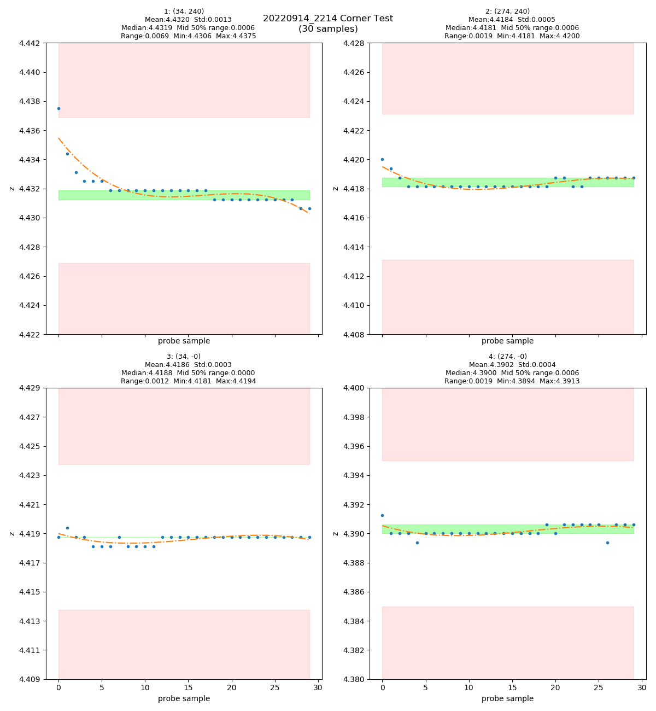
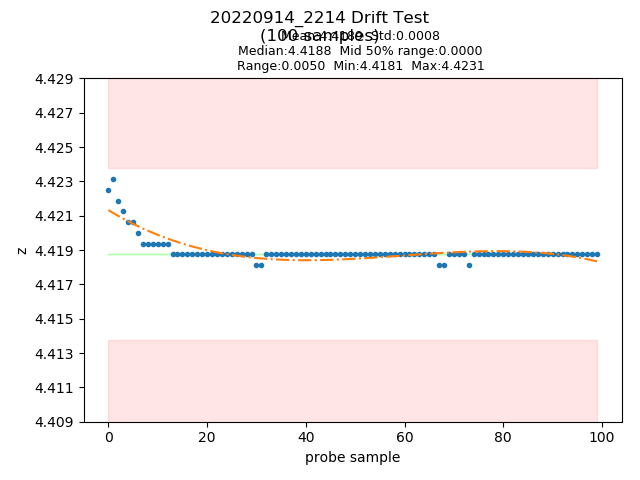

# Z Carriages FLEX

**Trident Z carriages with a compliant printed spring mechanism**

Trident Z carriages with a compliant printed spring mechanism to allow for some leadscrew wobble. 
Top leadscrew mounts are optional but Z is more accurate with them in my case.
Inspired by ortho-planar spring behavior studies.

Disclaimer: Only tested this on my printer, use at your own risk.

Credits for the original Z carriage design goes to the Voron team 
https://vorondesign.com/
